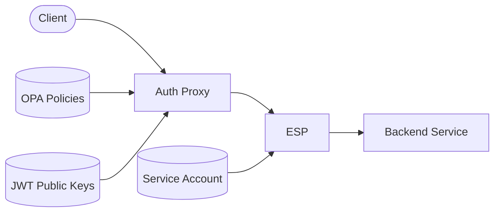
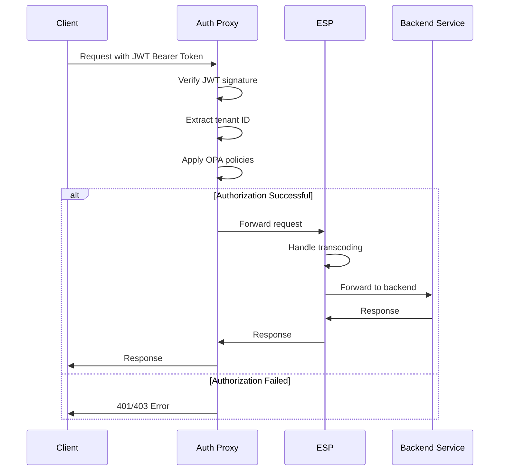

# Auth Proxy with Embedded OPA

A Go-based authorization proxy with embedded Open Policy Agent (OPA) for tenant isolation in multi-tenant applications. This proxy securely verifies JWT tokens and enforces tenant-based access controls.

## Features

- **JWT Token Verification**: Cryptographically verifies JWT signatures from Firebase Auth or other providers
- **Tenant Authorization**: Enforces tenant isolation using embedded OPA policies
- **Policy Management**: Dynamically loads, watches, and updates OPA policies
- **Metrics Collection**: Provides HTTP request and performance metrics
- **Structured Logging**: Configurable logging with various formats and levels
- **Health Monitoring**: Endpoints for system health checks
- **ESP Integration**: Works seamlessly with Google's Extensible Service Proxy for transcoding and authentication

## Architecture

The auth proxy sits in front of [Google ESP](https://cloud.google.com/endpoints/docs), providing tenant authorization before traffic reaches your backend service. While ESP handles authentication, our proxy focuses on token verification and tenant-based authorization:



### Auth Flow



## Getting Started

### Prerequisites

- Go 1.23+
- Docker (for containerization)
- Kubernetes (for deployment)
- Helm (for chart installation)

### Building

```bash
# Clone the repository
git clone https://github.com/emphereio/auth-proxy.git
cd auth-proxy

# Build the binary
go build -o auth-proxy ./cmd/main.go

# Build Docker image
docker build -t emphereio/auth-proxy:latest .
```

### Running Locally

```bash
# Run with default settings
./auth-proxy

# Run with custom configuration
export BACKEND_HOST=localhost
export BACKEND_PORT=9000
export TENANT_ID=your-tenant-id
export POLICY_DIR=./policies
export LOG_LEVEL=DEBUG
export LOG_FORMAT=console
./auth-proxy
```

### Environment Variables

| Variable | Description | Default |
|----------|-------------|---------|
| PORT | Port to listen on | 8080 |
| BACKEND_HOST | Backend service host (typically ESP) | localhost |
| BACKEND_PORT | Backend service port (typically ESP port) | 9000 |
| TENANT_ID | Expected tenant ID for validation | |
| POLICY_DIR | Directory containing OPA policies | /policies |
| REQUEST_TIMEOUT | Timeout for backend requests (seconds) | 10 |
| SHUTDOWN_TIMEOUT | Timeout for graceful shutdown (seconds) | 10 |
| LOG_LEVEL | Log level (TRACE, DEBUG, INFO, WARN, ERROR) | INFO |
| LOG_FORMAT | Log format (json, console) | json |
| ENVIRONMENT | Runtime environment (development, production) | production |
| POLICY_REFRESH_INTERVAL | Interval to check for policy updates (seconds) | 30 |

## Policy Configuration

The auth proxy uses OPA policies written in Rego to control tenant access. Policies are loaded from the `POLICY_DIR` directory.

### Default Policy

By default, the proxy implements a policy that:
- Denies all requests by default
- Allows access only if the tenant ID in the JWT matches the expected tenant ID
- Allows health, metrics, and OPTIONS requests without authentication

```rego
package http.authz

# Default deny
default allow = false

# Allow if the tenant ID in the token matches the tenant ID in the request header
allow {
    # Get tenant ID from request header
    input.attributes.request.http.headers["x-tenant-id"] != ""
    
    # Check if tenant IDs match
    input.attributes.request.http.headers["x-tenant-id"] == input.expected_tenant_id
}

# Additional allow rule for OPTIONS requests (CORS preflight)
allow {
    input.attributes.request.http.method == "OPTIONS"
}

# Health check and metrics endpoints are always allowed
allow {
    path := input.attributes.request.http.path
    startswith(path, "/health")
}

allow {
    path := input.attributes.request.http.path
    startswith(path, "/metrics")
}
```

### Creating Custom Policies

You can create custom policies by adding `.rego` files to the policy directory. The proxy will automatically load and apply them.

Example custom policy to allow specific roles:

```rego
package http.authz

# Allow access for admin role regardless of tenant
allow {
    # Get role from request header
    role := input.attributes.request.http.headers["x-role"]
    role == "admin"
}
```

## Deployment with ESP and Backend Service

### Kubernetes Deployment

```yaml
apiVersion: apps/v1
kind: Deployment
metadata:
  name: example-service
spec:
  replicas: 1
  selector:
    matchLabels:
      app: example-service
  template:
    metadata:
      labels:
        app: example-service
    spec:
      containers:
        - name: auth-proxy
          image: emphereio/auth-proxy:latest
          env:
            - name: TENANT_ID
              value: "tenant-name"
            - name: BACKEND_HOST
              value: "localhost"
            - name: BACKEND_PORT
              value: "9000"  # Point to ESP port
            - name: LOG_LEVEL
              value: "INFO"
            - name: POLICY_DIR
              value: "/policies"
          ports:
            - containerPort: 8080  # Entry point
          volumeMounts:
            - name: policy-volume
              mountPath: /policies
          livenessProbe:
            httpGet:
              path: /health
              port: 8080
            initialDelaySeconds: 10
            periodSeconds: 30

        - name: esp
          image: gcr.io/endpoints-release/endpoints-runtime:2.52.0
          args: [
            "--cors_preset=basic",
            "--cors_allow_origin=*",
            "--cors_allow_methods=GET,POST,PUT,DELETE,PATCH,OPTIONS",
            "--cors_allow_headers=Content-Type,Accept,Authorization,x-api-key",
            "--listener_port=9000",
            "--service=your-service-name.endpoints.project-id.cloud.goog",
            "--rollout_strategy=managed",
            "--backend=grpc://localhost:5000",  # Point to backend service
            "--healthz=/healthz",
            "--service_account_key=/service-account.json",
          ]
          ports:
            - containerPort: 9000
          volumeMounts:
            - name: service-account-volume
              mountPath: /service-account.json
              subPath: service-account.json

        - name: backend-service
          image: your-backend-service:latest
          ports:
            - containerPort: 5000
          # backend service configuration...

      volumes:
        - name: policy-volume
          configMap:
            name: opa-policies
        - name: service-account-volume
          secret:
            secretName: esp-service-account
```

### Policy ConfigMap

```yaml
apiVersion: v1
kind: ConfigMap
metadata:
  name: opa-policies
data:
  default.rego: |
    package http.authz
    
    # Default deny
    default allow = false
    
    # Allow if tenant IDs match
    allow {
        input.attributes.request.http.headers["x-tenant-id"] != ""
        input.attributes.request.http.headers["x-tenant-id"] == input.expected_tenant_id
    }
    
    # Allow health checks and OPTIONS
    allow {
        input.attributes.request.http.method == "OPTIONS"
    }
    
    allow {
        path := input.attributes.request.http.path
        startswith(path, "/health")
    }
    
    allow {
        path := input.attributes.request.http.path
        startswith(path, "/metrics")
    }
  
  # Add additional policy files as needed
  role-based.rego: |
    package http.authz
    
    # Allow admin role
    allow {
        role := input.attributes.request.http.headers["x-role"]
        role == "admin"
    }
```

### Service Configuration

```yaml
apiVersion: v1
kind: Service
metadata:
  name: example-service
spec:
  selector:
    app: example-service
  ports:
    - port: 443
      targetPort: 8080  # Auth proxy port
  type: ClusterIP
```

## JWT Verification

The auth proxy cryptographically verifies JWT tokens to ensure they haven't been tampered with. While it doesn't handle authentication itself (that's ESP's job), it ensures tokens are valid before authorization decisions are made.

### Firebase Auth Integration

Firebase JWT verification is built-in and works by:
1. Fetching public keys from Firebase at startup
2. Verifying JWT signatures with RSA public keys
3. Extracting tenant ID from claims
4. Refreshing keys periodically (every 6 hours)

### Customizing JWT Verification

If you use a different JWT provider, modify the `jwt.go` file to:
1. Update the public key URL
2. Adjust the token claims structure
3. Change the key parsing logic if needed

## Advanced Configuration

### Custom Policy Input

OPA policy input structure:

```json
{
  "attributes": {
    "request": {
      "http": {
        "headers": {
          "authorization": "Bearer <token>",
          "x-tenant-id": "<tenant-id>",
          ...
        },
        "method": "GET",
        "path": "/resource",
        "query": "param=value",
        "host": "example.com"
      }
    }
  },
  "expected_tenant_id": "<expected-tenant-id>"
}
```

### Health Checks

The auth proxy exposes a `/health` endpoint that returns:

```json
{
  "status": "healthy",
  "version": "1.0.0"
}
```

### Metrics

Access metrics at `/metrics` to view request counts, latencies, error rates, and more.

## Project Structure

```
auth-proxy/
├── cmd/
│   └── main.go                  # Application entry point
├── internal/
│   ├── config/                  # Configuration
│   ├── jwt/                     # JWT verification
│   ├── middleware/              # HTTP middleware components
│   ├── opa/                     # OPA engine and policy management
│   ├── proxy/                   # Reverse proxy
│   └── server/                  # HTTP server
├── pkg/
│   └── logging/                 # Logging utilities
├── policies/                    # Default OPA policies
├── Dockerfile
└── README.md
```

## Contributing

Contributions are welcome! Please feel free to submit a Pull Request.

## License

MIT License